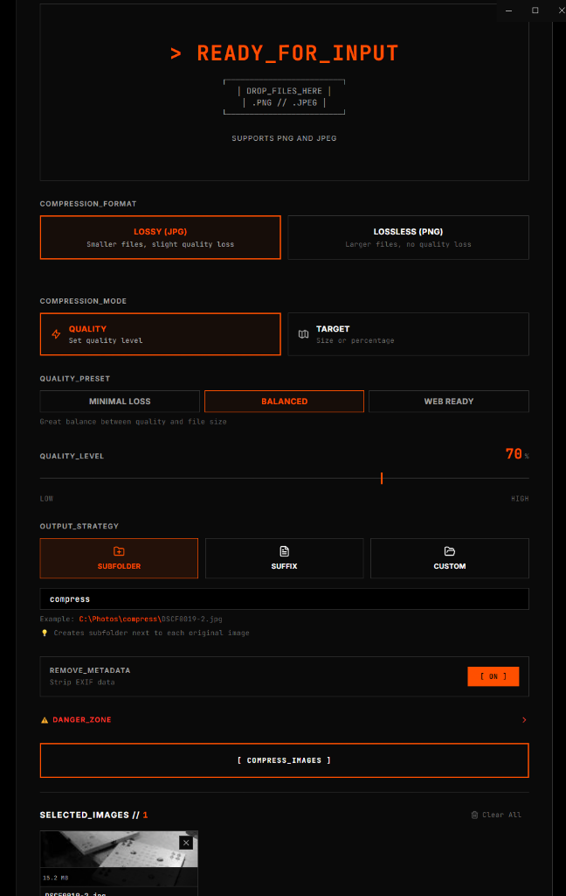

# QuickCompress ⚡

A modern, high-performance image compression tool for Windows.

<p align="center">
  
</p>

## 📥 Download

**For Users**: Download the latest installer from [Releases](https://github.com/jonheben/QuickCompress/releases)

Simply download `QuickCompress Setup 1.2.0.exe` and install it on your Windows PC.

## 🚀 Features

- **Smart Compression**: Optimize JPG and PNG images without visible quality loss
- **Drag & Drop**: Simple, intuitive interface
- **Output Strategies**: Save to subfolder, add suffix, or custom folder
- **Delete Originals**: Safely move to Recycle Bin after compression
- **Privacy First**: Toggle metadata removal (EXIF data) for smaller, cleaner files
- **Multiple Compression Modes**:
  - Quality mode (0-100 adjustable)
  - Target file size
  - Target percentage reduction
- **Batch Processing**: Compress multiple images at once with real-time progress
- **Parallel Processing**: Uses all CPU cores for faster compression

## 🎯 How to Use

1. Open QuickCompress from Start menu
2. Drag & drop images or folders into the app
3. Adjust compression settings:
   - Choose quality level (0-100)
   - Set target file size
   - Enable/disable metadata removal
   - Select output format (JPG/PNG)
   - Choose output strategy (Subfolder/Suffix/Custom)
4. Click "Compress Images"
5. View results and open output folder

## 📸 Screenshots

### Compression Progress & Results
<p align="center">
  
  
</p>

## 🛠️ For Developers

### Run Locally
```bash
# Install dependencies
npm install

# Start the app in development mode
npm start
```

### Build for Windows
```bash
# Create installer
npm run package
```

The installer will be created in `release/QuickCompress Setup 1.0.0.exe`

## 🏗️ Tech Stack

Built with **Electron**, **React**, **TypeScript**, and **Tailwind CSS**.

- **Frontend**: React 18 with TypeScript
- **Backend**: Electron 28 with Node.js
- **Image Processing**: Sharp (libvips)
- **State Management**: Zustand
- **Styling**: Tailwind CSS
- **Build Tool**: Vite

## 📝 License

MIT License - see [LICENSE](LICENSE) file for details

## 👤 Author

Jan Hebein

---

**Note**: Windows may show a security warning because the app isn't code-signed. Click "More info" → "Run anyway" to install.
